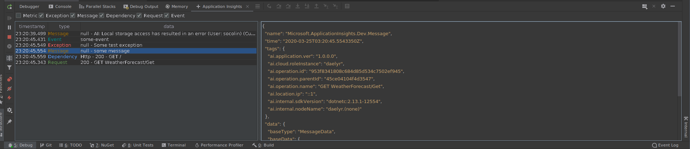

# DEPRECATION NOTICE:

> [!WARNING]  
> This plugin is now deprecated. A new plugin is available, see https://github.com/Socolin/ApplicationInsightsRiderPlugin/issues/27 for more information.

# Application Insights Debug Log Viewer

<!-- Plugin description -->
This plugin allow you to see, instantly, in a nice way [Application Insights](https://docs.microsoft.com/en-us/azure/azure-monitor/app/app-insights-overview)

To use just start a debug session with a program using Application Insights.
The logs will appear in a new tab in the debugger session.
<!-- Plugin description end -->

### Dev

To edit and test the plugin, just open this project with [InteliJ IDEA](https://www.jetbrains.com/idea/) and run the plugin with predefined run configuration

### Build

```
$ ./gradlew :buildPlugin -PbuildType=stable
```

Then the plugins will be in `build/distributions`

### Screenshot



### License

MIT

### Special thanks

 * Ivan Migalev: Help about Rider / InteliJ plugin API
 
